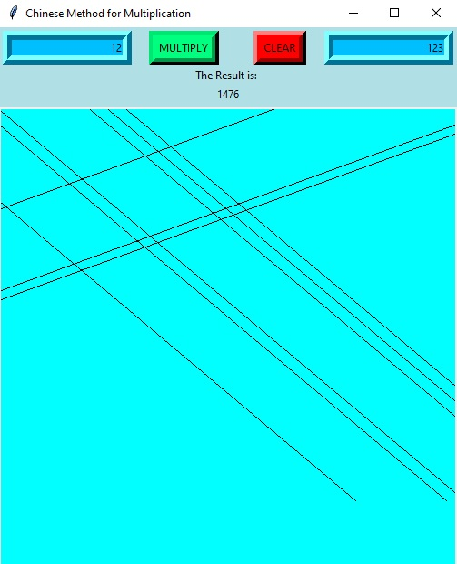

# Chinese Method for Multiplication

- This project represent an implementation of an old method for multiply numbers developed by chinese people.
- This project is made in Python.
- This project was a collaboration with <a href="https://github.com/gabrielaburtan"> Gabriela Burtan</a>.
- The file <a href="MetodaChinezeascaDeInmultire.pdf"> MetodaChinezeascaDeInmultire.pdf </a> is a documentation for the app written in Romanian.
```
The app has an algorithm behind to detect the intersection points and count them, exactly like the method and not just multiply the numbers using multiply operator!
```
The GUI is not very complex because this project was our first project in Python and we were just learning. The app is very simple:
1. The user enters the numbers in the TextBoxes.
2. The user presses the `Multiply` button, then the turtle starts drwing the lines and then the result is diplayed.
3. The user presses the `Clear` button to clear the TextBoxes and the Canvas.

